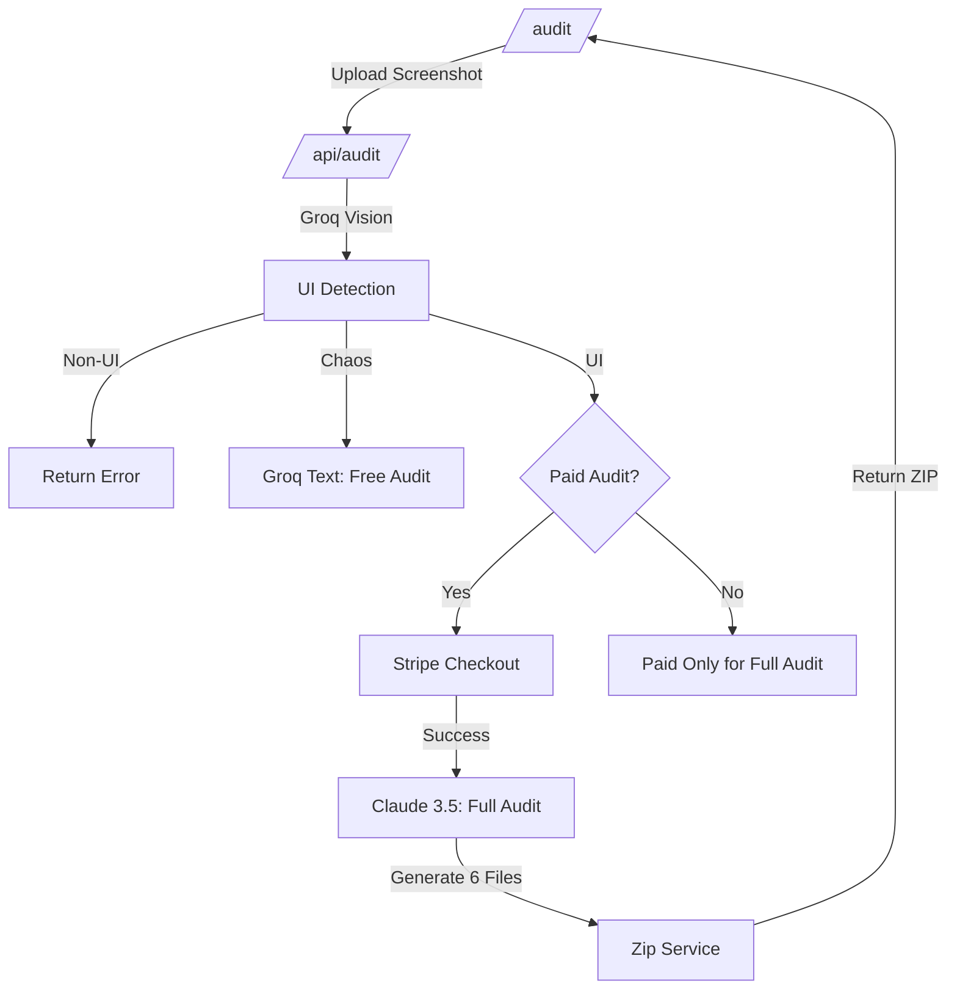

# ARCHITECTURE DEFINITION
Official architecture for the Iceberg Framework Landing Website.

## 1. FOLDER STRUCTURE
Following the **Iceberg Architecture Standard (App Router)**:

```
src/
  app/                     # Routing, Layouts, Metadata, Server Components
    [lang]/                # i18n dynamic route segment
      (marketing)/         # Route group for landing pages
        philosophy/        # /philosophy page
        methodology/       # /methodology page
        standards/         # /standards page
        protocols/         # /protocols page
        enterprise/        # /enterprise page
      page.tsx             # Home Page
      layout.tsx           # Multi-language layout
  features/                # Domain-specific UI and logic
    hero/                  # Parallax Iceberg Hero feature
    navigation/            # i18n Navbar and Mobile Menu
    standards-list/        # Standards visualization
    footer/                # Global footer
  domain/                  # Framework-agnostic logic
    i18n/                  # Language models and types
    framework/             # Principle definitions and models
  shared/                  # Reusable UI, hooks, utils
    ui/                    # Atomic components (Buttons, Cards, Typography)
    hooks/                 # Shared client-side hooks
    utils/                 # Pure functions (formatting, slugs)
    config/                # Global framework configuration
  infrastructure/          # External integrations
    i18n/                  # Dictionary fetchers and adapters
    theme/                 # Theme provider (next-themes wrapper)
    pwa/                   # Service worker registration and PWA logic
```

## 2. LAYER RESPONSIBILITIES

### **App Layer**
- Composition of pages using feature components.
- Metadata and SEO generation (Server-side).
- i18n route handling and locale detection.

### **Feature Layer**
- Self-contained modules like `hero` and `navigation`.
- Only imports from `domain`, `infrastructure`, and `shared`.

### **Domain Layer**
- Pure TypeScript models of Iceberg principles.
- No React dependencies.

### **Shared Layer**
- Stable UI primitives.
- Foundation for the entire project.

### **Infrastructure Layer**
- Managing the Service Worker for PWA.
- Dictionary loading for 8 languages.

## 3. DATA FLOW
1. **Request:** Next.js middleware detects locale.
2. **Server:** `app/[lang]/layout.tsx` fetches the dictionary.
3. **Server:** Metadata is generated for the specific language.
4. **Render:** Components receive content from the dictionary via props or context.
5. **PWA:** Service worker caches static assets and documentation pages for offline access.

## 4. THEME SYSTEM
- **Library:** `next-themes` (Standard for Next.js).
- **Strategy:** Client-side provider with `suppressHydrationWarning` on `<html>`.
- **Persistence:** Uses `localStorage` via the library to persist theme across route changes (which is critical for i18n routing).
- **Default:** System preference, falling back to light.

## 4. COMPONENT SYSTEM
- **Atomic UI:** Small, reusable components in `shared/ui`.
- **Feature Blocks:** Logical sections in `features/`.
- **Page Layouts:** Structural wrappers in `app/`.

## 5. AUDIT PIPELINE
The `/audit` feature uses an orchestrator pattern to manage the UI analysis workflow:



---

## 6. SECURITY LAYER
- **Input Validation:** Strict Zod-like validation for all API routes.
- **Rate Limiting:** Edge-level protection for AI resources (Upstash/Redis).
- **File Safety:** 4MB limit on Base64 image payload to prevent OOM (Out of Memory) attacks.
- **CORS:** Restricted to official Iceberg domains only.

---

## 6. SECURITY LAYER
- **Input Validation (The Customs Layer):** Strict schema enforcement for all API routes using Zod.
- **Rate Limiting:** Edge-level protection against brute-force and resource abuse (Upstash/Redis).
- **Payload Constraints:** 4MB/5MB character limit on image data to prevent memory exhaustion.
- **CORS Policy:** Restricted access to authorized Iceberg domains only.

## 7. ADVANCED SECURITY ROADMAP
Following the Enterprise Hardening phase, the following vectors are active:
- **Content Security Policy (CSP):** [ACTIVE] Prevent XSS and unauthorized script execution.
- **Prompt Injection Defense:** [ACTIVE] Model-level instructions to ignore spoofed UI text.
- **Telegram Alerts:** [PLANNED] Real-time notification for Rate Limit and Validation breaches.
- **Timeout Guard:** [PLANNED] Strict 30s execution limit for LLM calls.
- **AI Audit Logs:** [PLANNED] Governance-ready storage of AI interactions (Metadata only).

## 8. PRIVACY TIER (STATELESSNESS)
- **Zero-Storage Policy:** No UI assets are stored in databases or file systems.
- **In-Memory Processing:** Assets exist only during the request lifecycle.
- **API Sovereignty:** AI providers (Claude/Groq) are configured to exclude data from training sets.
- **Legal Base:** See [PRIVACY_POLICY.md](file:///c:/Users/Andrii/Desktop/iceberg-landing-3/docs/PRIVACY_POLICY.md).

---

## STOP‑CHECK
- [x] Folder structure validated (Iceberg Compliant)
- [x] No conflicts with Repo B
- [x] Terminology consistent
- [x] Security Layer formally defined
